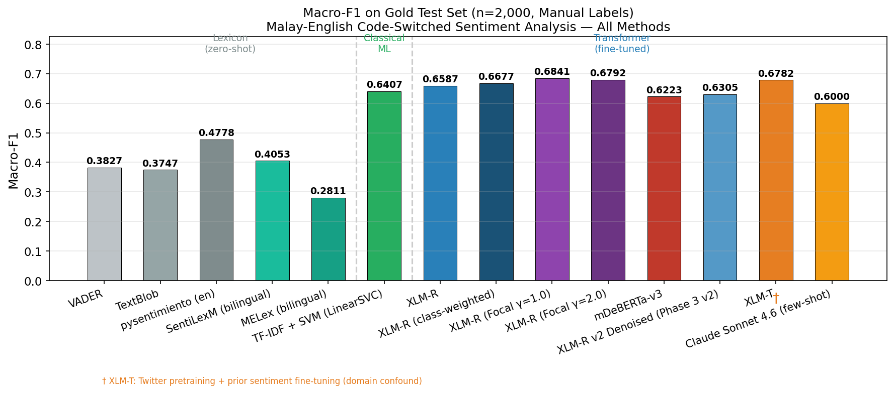

# Malay-English Code-Switched Sentiment Analysis

Joint MSc Artificial Intelligence research project by Joshua Thomas and Amit Gupta.

This repository benchmarks sentiment analysis methods on Malay-English code-switched social media text, moving from lexicon and classical ML baselines through transformer fine-tuning and LLM evaluation.

## 30-Second Summary

- **Problem:** code-switching breaks many sentiment systems because speakers mix languages inside the same sentence.
- **Dataset scale:** 19,714 Malay-English tweets in the main corpus.
- **Best robust result:** XLM-R with focal loss reached **0.6748 mean Macro-F1** across three seeds, with **95% CI [0.6664, 0.6832]**.
- **Best single run:** 0.6841 Macro-F1, reported as context rather than the headline result.
- **Important negative result:** LLM denoising reduced Macro-F1 by 0.0282, so it was not treated as an improvement.



## Key Results

| Method family | Best model/config | Macro-F1 | What it showed |
| --- | ---: | ---: | --- |
| Lexicon / zero-shot | pysentimiento | 0.4778 | General sentiment tools struggle on code-switched text. |
| Classical ML | TF-IDF + SVM | 0.6407 | Strong baseline; simpler methods remain competitive. |
| Transformer | XLM-R focal loss, mean across 3 seeds | 0.6748 | Best robust result after class-imbalance handling. |
| Transformer, best single run | XLM-R focal loss gamma=1.0 | 0.6841 | Peak run, not used as the main headline. |
| LLM direct annotator | Claude few-shot | 0.6000 | Useful comparator, weaker than tuned ML models. |
| LLM denoising | XLM-R after denoising | 0.6305 | Negative result; denoising hurt performance. |

The main takeaway is not “transformers always win.” The honest result is narrower: focal loss improved XLM-R on this dataset, but a strong SVM baseline remained close enough to matter.

## What To Inspect First

1. [`results/results_table.csv`](results/results_table.csv) for the compact result table.
2. [`results/analysis_summary.json`](results/analysis_summary.json) for confidence intervals, deltas, and negative-result notes.
3. [`notebooks/03_results_analysis.ipynb`](notebooks/03_results_analysis.ipynb) for the aggregation and chart generation.
4. [`README_RUN_ORDER.txt`](README_RUN_ORDER.txt) for the full execution sequence and hardware/API requirements.
5. [`report/Programming_in_AI.pdf`](report/Programming_in_AI.pdf) for the final report.

## Repository Structure

```text
notebooks/      Numbered notebooks, intended to run in documented order
src/            Shared config and path definitions
results/        Published charts, CSV summaries, and JSON metrics
report/         Final report and presentation script
requirements.txt
README_RUN_ORDER.txt
```

Raw datasets and the generated SQLite database are intentionally excluded from this public repository. The repo keeps the code, small result artifacts, charts, and report needed to understand the work without redistributing corpora whose licensing may be restricted.

## Reproduce

```bash
python -m venv .venv
source .venv/bin/activate
pip install -r requirements.txt
jupyter notebook notebooks/
```

Run notebooks in the order listed in [`README_RUN_ORDER.txt`](README_RUN_ORDER.txt).

Important constraints:

- Transformer notebooks require a GPU; the original run used an RTX 4060 Ti 16 GB.
- LLM denoising and LLM benchmarking require `ANTHROPIC_API_KEY`.
- Some notebooks need internet access for HuggingFace datasets or model checkpoints.
- Full reproduction needs the original datasets, which are not redistributed here.

## Limitations

- Results are dataset-specific and should not be generalized to all Malay-English or multilingual social media text.
- The confidence interval uses only three seeds, so it is useful but not definitive.
- Label noise was substantial, and the positive class remained the hardest class.
- LLM denoising was tested and rejected for this setup because it reduced Macro-F1.

## Authors

- Joshua Joenathan Thomas
- Amit Kumar Gupta

MSc Artificial Intelligence, National College of Ireland.
